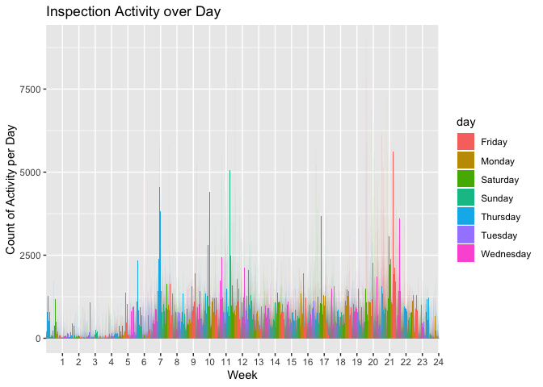

Homework 3
================

``` r
knitr::opts_chunk$set(echo = TRUE)

library(tidyverse)
```

    ## ── Attaching packages ────────────────────────────────────────────────────── tidyverse 1.2.1 ──

    ## ✔ ggplot2 3.2.1     ✔ purrr   0.3.2
    ## ✔ tibble  2.1.3     ✔ dplyr   0.8.3
    ## ✔ tidyr   1.0.0     ✔ stringr 1.4.0
    ## ✔ readr   1.3.1     ✔ forcats 0.4.0

    ## ── Conflicts ───────────────────────────────────────────────────────── tidyverse_conflicts() ──
    ## ✖ dplyr::filter() masks stats::filter()
    ## ✖ dplyr::lag()    masks stats::lag()

``` r
library(p8105.datasets)
data("instacart")
ins_aisles = instacart %>% 
  count(aisle, name = "aisle_order_count") %>% 
  arrange(desc(aisle_order_count))


library(ggplot2)
ins_aisles %>% 
filter(aisle_order_count > 10000) %>% 
ggplot(aes(x = aisle_order_count, y = aisle)) + 
  geom_point()
```

<!-- -->

``` r
#create a table showing the most popular items in each of three categories
instacart2 = instacart %>% 
  select(aisle_id, aisle, product_name) %>% 
  filter(aisle %in% c("baking ingredients", "dog food care", "packaged vegetables fruits")) %>% 
count(aisle, product_name) %>% 
group_by(aisle) %>% 
top_n(3) %>% 
  knitr::kable()
```

    ## Selecting by n

``` r
instacart2
```

| aisle                      | product\_name                                 |    n |
| :------------------------- | :-------------------------------------------- | ---: |
| baking ingredients         | Cane Sugar                                    |  336 |
| baking ingredients         | Light Brown Sugar                             |  499 |
| baking ingredients         | Pure Baking Soda                              |  387 |
| dog food care              | Organix Chicken & Brown Rice Recipe           |   28 |
| dog food care              | Small Dog Biscuits                            |   26 |
| dog food care              | Snack Sticks Chicken & Rice Recipe Dog Treats |   30 |
| packaged vegetables fruits | Organic Baby Spinach                          | 9784 |
| packaged vegetables fruits | Organic Blueberries                           | 4966 |
| packaged vegetables fruits | Organic Raspberries                           | 5546 |

# Description of the dataframe

  - The size of the dataset instacart is 1384617 rows and 15 columns.
  - Some of the key variables are order\_id and product\_name
  - The most number of orders are placed from the fresh vegetables aisle
    and fresh vegetables aisle.
  - The 3 most popular items ordered from these aisles are:
  - baking ingredients: Light brown sugar (499), pure baking soda (387),
    and cane sugar (336)
  - dog food care: Snack Sticks Chicken & Rice Recipe Dog Treats (30),
    Organix Chicken & Brown Rice Recipe (28), Small Dog Biscuits (26)
  - packaged food vegetables: Organic Baby Spinach (9784), Organic
    Raspberries (5546), Organic Blueberries
(4966)

<!-- end list -->

``` r
#A table showing the mean hour of the day at which Pink Lady Apples and Coffee Ice Cream are ordered on each day of the week
icecream_apples = instacart %>% 
  filter(product_name %in% c("Pink Lady Apples", "Coffee Ice Cream")) %>% 
  select(order_dow, order_hour_of_day, product_name) %>%
  arrange(desc(order_dow)) %>% 
  group_by(order_dow) %>% 
  summarise(average_order_hour_of_day = mean(order_hour_of_day)) %>% 
  mutate(order_dow = recode(order_dow, `1` = 'Mon', `2` = 'Tues', `3` = 'Wed', `4` = 'Thur', `5` = 'Fri', `6` = 'Sat', `0` = 'Sun')) %>% 
  pivot_wider(names_from = order_dow, values_from = average_order_hour_of_day)
  knitr::kable(icecream_apples)
```

|  Sun |      Mon |     Tues |      Wed |     Thur |      Fri |   Sat |
| ---: | -------: | -------: | -------: | -------: | -------: | ----: |
| 13.6 | 12.17391 | 12.83824 | 14.68519 | 13.17308 | 12.64286 | 13.25 |

``` r
data("brfss_smart2010") 
health = brfss_smart2010 %>% 
  janitor::clean_names() %>% 
  filter(topic == "Overall Health") %>% 
  filter(response %in% c("Excellent", "Very good", "Good", "Fair", "Poor")) %>%
  mutate(
    response = as.factor(response), 
    response = fct_relevel(response, c("Poor","Fair", "Good","Very good","Excellent"))) %>% 
    arrange(response, desc(response))
```

``` r
data("brfss_smart2010") 
states = brfss_smart2010 %>% 
  janitor::clean_names() %>%
  select(locationabbr, locationdesc, year) %>% 
  filter(year %in% c("2002","2010")) %>%
  group_by(year, locationabbr) %>% 
  summarise(n_location = n_distinct(locationdesc)) %>%
  filter(n_location >= 7)
```

In 2002, there were 6 states that were observed at 7 or more locations.
They were CT, FL, MA, NC, NJ, and PA.

In 2010, there was a significant increase in the number of locations
that satisfy our requirements. Specifically, 14 states were observed at
7 or more locations. They were CA, CO, FL, MA, MD, NC, NE, NJ, NY, OH,
PA, SC, TX, and WA.

``` r
data("brfss_smart2010") 
excellent = brfss_smart2010 %>% 
  janitor::clean_names() %>%
  select(year, locationabbr, response, data_value) %>% 
  filter(response == "Excellent") %>%
  group_by(year, locationabbr) %>% 
  summarise(mean_val = mean(data_value)) 
```

\#Creating a spaghetti
plot

``` r
ggplot(excellent, aes(x = year, y = mean_val, color = factor(locationabbr))) +geom_line() +theme_bw()
```

    ## Warning: Removed 3 rows containing missing values (geom_path).

<!-- -->

\#Two panel plot

``` r
plot = brfss_smart2010 %>%
  janitor::clean_names() %>%
  filter(year %in% c("2006","2010"),response %in% c("Excellent", "Very good", "Good", "Fair","Poor")) %>%
  select(year, locationabbr, response, data_value, locationdesc) %>%
drop_na() %>%
mutate(
response = as.factor(response),
response = fct_relevel(
response, "Poor","Fair","Good","Very good","Excellent")) %>%
filter(locationabbr == "NY") %>%
group_by(year, locationdesc, locationabbr)


ggplot(plot, aes(x = response, y = data_value, fill = locationdesc)) +
geom_bar(stat = "identity", position = "dodge") +
facet_grid(year ~.) +
labs(x = "Response", y = "Data Value", title = "Distribution of responses among locations in NY")
```

<!-- -->

``` r
accel= read_csv("accel_data.csv") %>% 
  janitor::clean_names() %>% 
  pivot_longer(
    activity_1:activity_1440,
    names_to = "activity_number",
    values_to = "activity_counts"
  ) %>% 
mutate(
  WeekDay = ifelse(day == "Saturday" | day == "Sunday", "weekend", "weekday")
) %>% #A new variable to indicate whether the day is a weekday or weekend 
  mutate(
  activity_number = factor(activity_number)) # change activity number as a factor
```

    ## Parsed with column specification:
    ## cols(
    ##   .default = col_double(),
    ##   day = col_character()
    ## )

    ## See spec(...) for full column specifications.

``` r
  knitr::kable(head(accel,30)) # looking at the first 30 observations. 
```

| week | day\_id | day    | activity\_number | activity\_counts | WeekDay |
| ---: | ------: | :----- | :--------------- | ---------------: | :------ |
|    1 |       1 | Friday | activity\_1      |         88.37778 | weekday |
|    1 |       1 | Friday | activity\_2      |         82.24444 | weekday |
|    1 |       1 | Friday | activity\_3      |         64.44444 | weekday |
|    1 |       1 | Friday | activity\_4      |         70.04444 | weekday |
|    1 |       1 | Friday | activity\_5      |         75.04444 | weekday |
|    1 |       1 | Friday | activity\_6      |         66.26667 | weekday |
|    1 |       1 | Friday | activity\_7      |         53.75556 | weekday |
|    1 |       1 | Friday | activity\_8      |         47.84444 | weekday |
|    1 |       1 | Friday | activity\_9      |         55.46667 | weekday |
|    1 |       1 | Friday | activity\_10     |         42.95556 | weekday |
|    1 |       1 | Friday | activity\_11     |         46.75556 | weekday |
|    1 |       1 | Friday | activity\_12     |         25.48889 | weekday |
|    1 |       1 | Friday | activity\_13     |         18.97778 | weekday |
|    1 |       1 | Friday | activity\_14     |         31.11111 | weekday |
|    1 |       1 | Friday | activity\_15     |         22.86667 | weekday |
|    1 |       1 | Friday | activity\_16     |         24.80000 | weekday |
|    1 |       1 | Friday | activity\_17     |         51.02222 | weekday |
|    1 |       1 | Friday | activity\_18     |         35.48889 | weekday |
|    1 |       1 | Friday | activity\_19     |         40.97778 | weekday |
|    1 |       1 | Friday | activity\_20     |         59.02222 | weekday |
|    1 |       1 | Friday | activity\_21     |         25.17778 | weekday |
|    1 |       1 | Friday | activity\_22     |         19.42222 | weekday |
|    1 |       1 | Friday | activity\_23     |         44.71111 | weekday |
|    1 |       1 | Friday | activity\_24     |         17.13333 | weekday |
|    1 |       1 | Friday | activity\_25     |         43.88889 | weekday |
|    1 |       1 | Friday | activity\_26     |         47.46667 | weekday |
|    1 |       1 | Friday | activity\_27     |         46.11111 | weekday |
|    1 |       1 | Friday | activity\_28     |         34.64444 | weekday |
|    1 |       1 | Friday | activity\_29     |         40.28889 | weekday |
|    1 |       1 | Friday | activity\_30     |         46.46667 | weekday |

  - The total number of rows in accel\_data are 50400 and the total
    number of columns are 6.

<!-- end list -->

``` r
accel_day = 
accel %>% 
  group_by(week,day) %>%
  mutate(
    sum_activity_day = sum(activity_counts)
    ) %>% 
  select(week, day_id, day, sum_activity_day) %>% 
  distinct()
  knitr::kable(accel_day)
```

| week | day\_id | day       | sum\_activity\_day |
| ---: | ------: | :-------- | -----------------: |
|    1 |       1 | Friday    |          480542.62 |
|    1 |       2 | Monday    |           78828.07 |
|    1 |       3 | Saturday  |          376254.00 |
|    1 |       4 | Sunday    |          631105.00 |
|    1 |       5 | Thursday  |          355923.64 |
|    1 |       6 | Tuesday   |          307094.24 |
|    1 |       7 | Wednesday |          340115.01 |
|    2 |       8 | Friday    |          568839.00 |
|    2 |       9 | Monday    |          295431.00 |
|    2 |      10 | Saturday  |          607175.00 |
|    2 |      11 | Sunday    |          422018.00 |
|    2 |      12 | Thursday  |          474048.00 |
|    2 |      13 | Tuesday   |          423245.00 |
|    2 |      14 | Wednesday |          440962.00 |
|    3 |      15 | Friday    |          467420.00 |
|    3 |      16 | Monday    |          685910.00 |
|    3 |      17 | Saturday  |          382928.00 |
|    3 |      18 | Sunday    |          467052.00 |
|    3 |      19 | Thursday  |          371230.00 |
|    3 |      20 | Tuesday   |          381507.00 |
|    3 |      21 | Wednesday |          468869.00 |
|    4 |      22 | Friday    |          154049.00 |
|    4 |      23 | Monday    |          409450.00 |
|    4 |      24 | Saturday  |            1440.00 |
|    4 |      25 | Sunday    |          260617.00 |
|    4 |      26 | Thursday  |          340291.00 |
|    4 |      27 | Tuesday   |          319568.00 |
|    4 |      28 | Wednesday |          434460.00 |
|    5 |      29 | Friday    |          620860.00 |
|    5 |      30 | Monday    |          389080.00 |
|    5 |      31 | Saturday  |            1440.00 |
|    5 |      32 | Sunday    |          138421.00 |
|    5 |      33 | Thursday  |          549658.00 |
|    5 |      34 | Tuesday   |          367824.00 |
|    5 |      35 | Wednesday |          445366.00 |

A plot:

``` r
accel %>% mutate(
  activity_number = factor(substr(activity_number,10,13), ordered = TRUE, levels = c(1:1440))
  ) %>% 
  ggplot(aes(x = factor(activity_number), y = activity_counts, fill = day)) +
  scale_x_discrete(breaks = seq(60, 1440, by=60),labels = as.character(c(1:24))) +
  geom_bar(stat = "identity", position = "dodge") +
  labs(
    title = "Inspection Activity over Day",
    x = "Week",
    y = "Count of Activity per Day"
  )
```

<!-- -->
